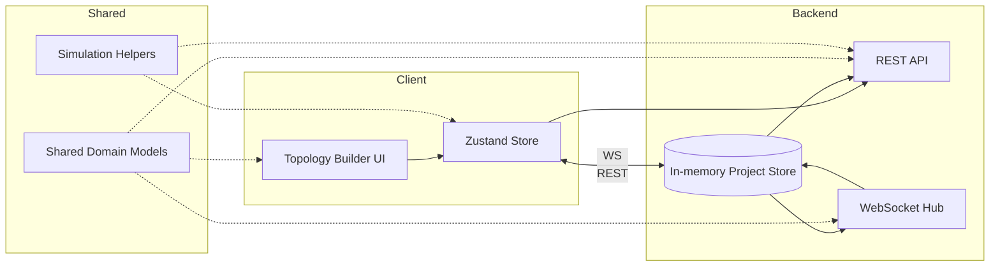
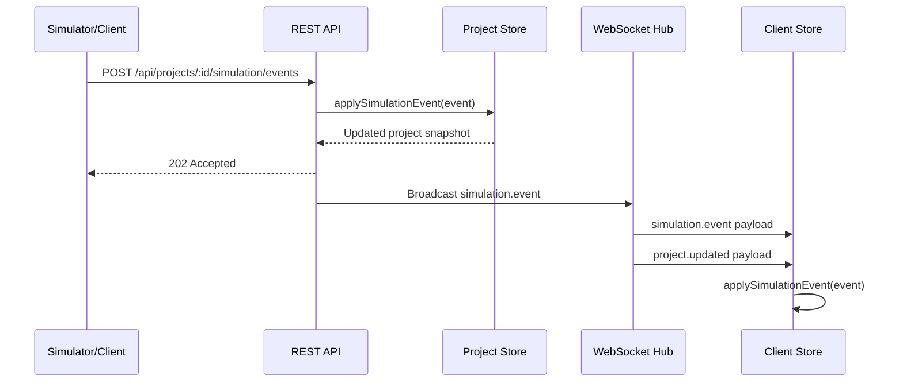

# 🛰️ Network Simulation Platform

> A collaborative playground for designing topologies, orchestrating devices, and replaying packet flows in real time.

<div align="center">
  
  
  
</div>

## ✨ What makes it special?

- **Unified domain language** – Shared TypeScript contracts keep backend, frontend, and docs perfectly in sync.
- **Real-time aware** – WebSocket broadcasts mirror RESTful changes, so every client stays up to date.
- **Simulation-first** – Device, link, and packet abstractions are tuned for replaying network events with granular metrics.
- **Studio-grade frontend state** – The Zustand store now powers device palettes, cable builders, annotation layers, and scenario labs inspired by Cisco Packet Tracer.

---

## 🧭 Directory map

```text
src/
├── backend/            # Express REST API + WebSocket gateway
├── frontend/state/     # Zustand store and state helpers
└── shared/             # Domain models & simulation utilities
```

Additional knowledge lives in [`docs/data-contracts.md`](./docs/data-contracts.md).

---

## 🚀 Quick start

```bash
# install dependencies
pnpm install

# generate TypeScript types & JS output
pnpm build

# launch the backend (default port: 4000)
pnpm exec ts-node --project tsconfig.json src/backend/server.ts
```

Once the server boots you can:

- `GET http://localhost:4000/api/projects` to fetch project summaries
- Open a WebSocket at `ws://localhost:4000/ws/simulation` for live updates
- `POST /api/projects/:id/simulation/events` to stream simulation changes

---

## 🎨 Frontend command center

| Feature | What it brings |
| --- | --- |
| **Device palette** | A curated catalogue of routers, switches, firewalls, wireless controllers, IoT gateways, and end devices with realistic interface blueprints. |
| **Cable builder** | Draft a connection, pick a medium (Cat6, fiber, serial, or wireless), and drop links with color-coded metadata. |
| **Layer manager** | Physical, logical, security, and wireless layers toggle independently—with lock states to avoid accidental edits. |
| **Annotation studio** | Drop text call-outs, zones, and shapes to mark VLANs, subnets, and change windows directly on the canvas. |
| **Scenario lab** | Snapshot a topology into learning scenarios, set objectives, and rehydrate snapshots at any time for training drills. |
| **Playback timeline** | Bookmark events, scrub ticks, and loop key simulations with a Packet-Tracer style time slider. |
| **Layout intelligence** | Auto-align, grid, circle, or tree layouts to keep diagrams presentation-ready in a single click. |

These capabilities live purely in state today, so connecting them to a React or WebGL workspace is as simple as wiring the selectors you need.

---

## 🎛️ Platform topology



---

## 🛰️ Simulation signal flow



---

## 🧩 Shared contracts at a glance

| Entity | Purpose | Highlight |
| --- | --- | --- |
| `Device` | Represents a single switch, router, host, or firewall | Contains interfaces, configuration, and spatial metadata |
| `Link` | Connects two interface endpoints | Tracks bandwidth, latency, and status for visualization |
| `Packet` | Logical simulation payload | Includes source/destination endpoints and payload classification |
| `SimulationState` | Snapshot of the simulator | Holds metrics, tick counter, and lifecycle timestamps |
| `SimulationEvent` | Immutable stream of changes | Drives both backend persistence and frontend animation |

Dive deeper inside [`src/shared/types.ts`](./src/shared/types.ts).

---

## 🌌 Future ideas

- Persist the in-memory project store to a real database (SQLite, Postgres, or MongoDB).
- Pair the Zustand store with a React UI to visualise packet flows.
- Attach a worker-based simulation engine that feeds the event endpoint.

> _"Networks are stories told through packets. Let's make them epic."_
