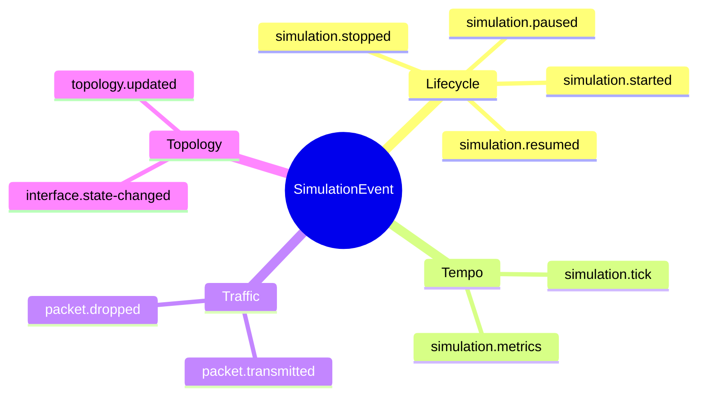
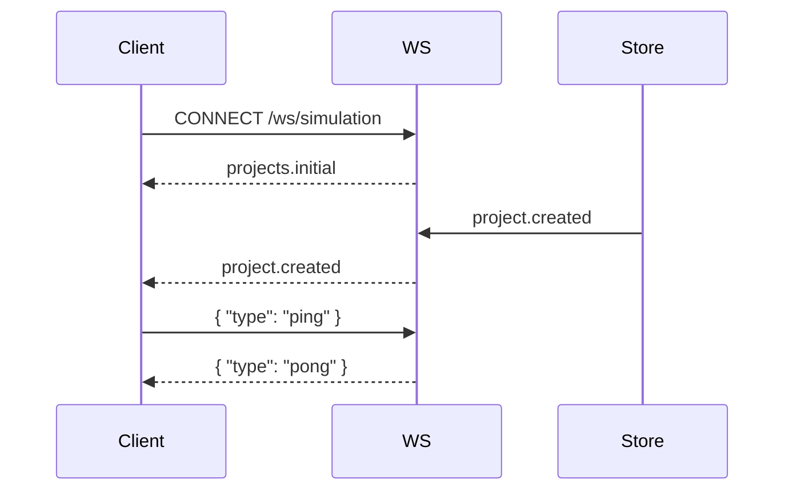
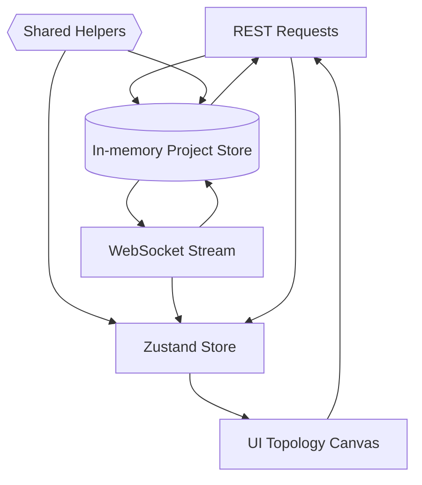

# 🌐 Network Simulation Data Contracts & Flows

> _One domain language, shared across backend, frontend, and docs._
>
> Everything under `src/shared` is the truth source. Import the types, follow the shapes, and your features stay in lockstep.


---

## 1. Canonical entities

Each object is intentionally ergonomic for canvas visualisers, config editors, and stream processors. They live in [`src/shared/types.ts`](../src/shared/types.ts).

| Entity | Core role | Favourite fields |
| --- | --- | --- |
| `Device` | Switch, router, host, firewall, or custom node | `interfaces`, `configuration.capabilities`, `status`, `position` |
| `DeviceInterface` | L2/L3 edge of a device | `macAddress`, `ipv4`, `ipv6`, `status`, `metadata` |
| `Link` | Connects two interface endpoints | `bandwidthMbps`, `latencyMs`, `status`, `metadata` |
| `Packet` | Logical payload moving across a link | `payloadType`, `sizeBytes`, `ttl`, `metadata` |
| `SimulationState` | Snapshot of the simulator heartbeat | `status`, `currentTick`, `metrics`, `lastEventId` |
| `SimulationEvent` | Immutable change description | `simulation.*`, `packet.*`, `interface.state-changed`, `topology.updated` |
| `Project` | Container for topology + simulation log | `topology`, `simulation`, `eventLog`, `tags` |

### Event taxonomy



> 💡 **Tip:** `SimulationEvent` is discriminated by `type`, so TypeScript narrows payloads automatically.

---

## 2. Simulation helpers

The helper toolkit in [`src/shared/simulation.ts`](../src/shared/simulation.ts) gives both backend and frontend deterministic behaviour.

| Helper | What it does | Why it matters |
| --- | --- | --- |
| `createInitialSimulationMetrics()` | Produces zeroed counters | Makes sure metrics objects are never `undefined` |
| `ensureSimulationState(state?)` | Pads missing fields with defaults | Simplifies migrations and partial updates |
| `applySimulationEvent(project, event)` | Pure function applying an event | Guarantees identical results across server and client |
| `normalizeProject(project)` | Sanitises topology/device arrays | Avoids rendering edge cases on the canvas |
| `normalizeProjects(projects)` | Map of normalised projects keyed by id | Perfect fit for Zustand state map |

```ts
import { applySimulationEvent } from '@shared';

const nextProject = applySimulationEvent(currentProject, event);
// ✅ Both backend and frontend derive the exact same mutations
```

---

## 3. Backend surface area

The Express server (`src/backend/server.ts`) is stateless outside an **in-memory project store**. The store itself speaks the shared language, so swapping to a database involves zero schema gymnastics.

### REST endpoints

| Method | Path | Notes |
| --- | --- | --- |
| `GET` | `/api/projects` | Returns `ProjectSummary[]` for lightweight dashboards |
| `POST` | `/api/projects` | Accepts `ProjectCreateRequest`; validates `name` + `topology` |
| `GET` | `/api/projects/:projectId` | Full `Project` payload (topology + simulation state + log) |
| `PUT` | `/api/projects/:projectId` | `ProjectUpdateRequest`; respects partial updates |
| `DELETE` | `/api/projects/:projectId` | Idempotently removes a project |
| `POST` | `/api/projects/:projectId/simulation/events` | Hydrates `id` + `timestamp` if missing, applies event, broadcasts |

Sample create request:

```jsonc
{
  "name": "Campus Core",
  "description": "Lab topology for QoS experiments",
  "topology": {
    "devices": [
      {
        "id": "rtr-1",
        "name": "Core Router",
        "role": "router",
        "status": "online",
        "configuration": { "capabilities": ["routing", "monitoring"] },
        "interfaces": [
          { "id": "ge-0/0/0", "name": "uplink", "macAddress": "AA:BB:CC:DD:EE:FF", "status": "up" }
        ]
      }
    ],
    "links": []
  }
}
```

### WebSocket channel

| Message | Payload | Dispatch trigger |
| --- | --- | --- |
| `projects.initial` | `Project[]` snapshot on connection | Connection handshake |
| `project.created` | `Project` | REST `POST /api/projects` |
| `project.updated` | `Project` | REST `PUT` or simulation events |
| `project.deleted` | `{ projectId }` | REST `DELETE` |
| `simulation.event` | Individual `SimulationEvent` | Any accepted simulation event |
| `pong` | `{ timestamp }` | Reply to client `{ "type": "ping" }` |
| `error` | `{ message }` | Malformed client messages |

Connection flow:



---

## 4. Frontend state orchestration

The Zustand store (`src/frontend/state/networkStore.ts`) mirrors backend logic, making UI layers predictable.

### Slice overview

| State field | Description | Notes |
| --- | --- | --- |
| `projects` | Map of `Project` keyed by `id` | Always normalised | 
| `activeProjectId` | Project in focus | Defaults to the first available |
| `eventLog` | Rolling window of `SimulationEvent` | Clipped to `MAX_EVENT_LOG_ENTRIES` |
| `topologyDraft` | Transient topology edits | Useful for staged editor workflows |
| `selectedDeviceId` / `selectedLinkId` | Canvas/UI selection | Auto-clears when items disappear |
| `isSyncing` | Generic loading flag | Hook into REST + WS lifecycles |

### High-signal actions

- `setProjects(projects)` – Hydrate from REST/WS snapshots.
- `upsertProject(project)` – Merge updates while auto-selecting the first project.
- `recordSimulationEvent(event)` – Purely applies state via shared helper then appends to the global log.
- `patchDevice(deviceId, patch)` / `patchLink(linkId, patch)` – Lightweight mutations when editing locally.
- `reset()` – Clears everything, ideal for logout/cleanup flows.

```ts
import { useNetworkStore } from '@/frontend/state/networkStore';

const record = useNetworkStore.getState().recordSimulationEvent;
record(eventFromSocket);
```

---

## 5. Putting it together



### Lifecycle narrative
1. REST responses and WebSocket broadcasts pipe through shared helpers.
2. Zustand ingests the same contracts, ensuring visual state matches server truth.
3. Editors tweak `topologyDraft`, push updates via REST, and immediately see broadcasts.

> 🪄 **Next step idea:** Add a background worker that emits packet events in real time—your UI already knows how to digest them.

---

## 6. Reference glossary

| Term | Meaning |
| --- | --- |
| **Topology** | The device + link graph that the simulator understands |
| **Simulation tick** | Incrementing counter indicating progression of the simulator clock |
| **Metrics** | Snapshot stats (latency, throughput, packet counts) refreshed via events |
| **Event log** | Chronological list of timeline entries, trimmed to keep clients fast |

Stay curious, keep packets flowing, and make the topology glow ✨
