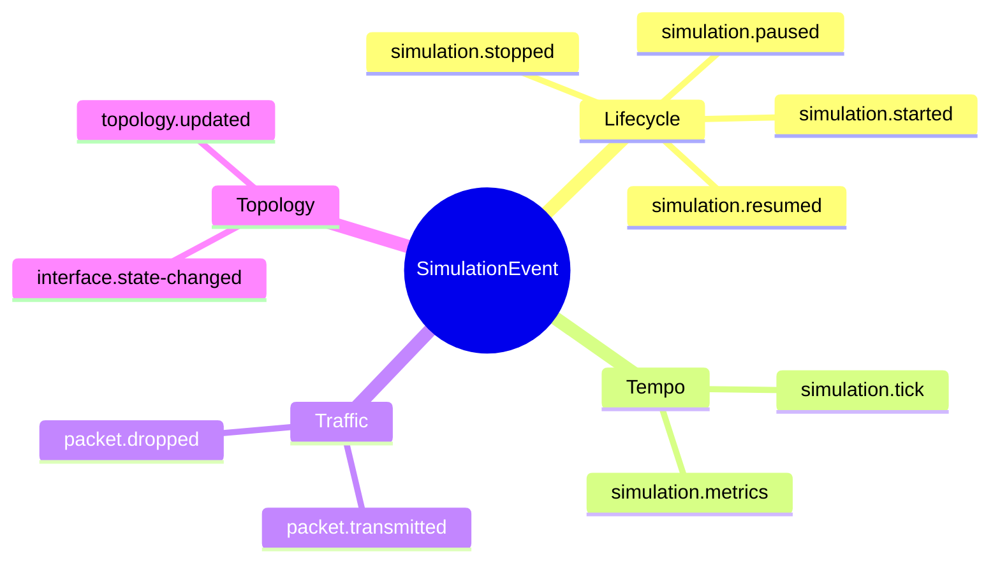
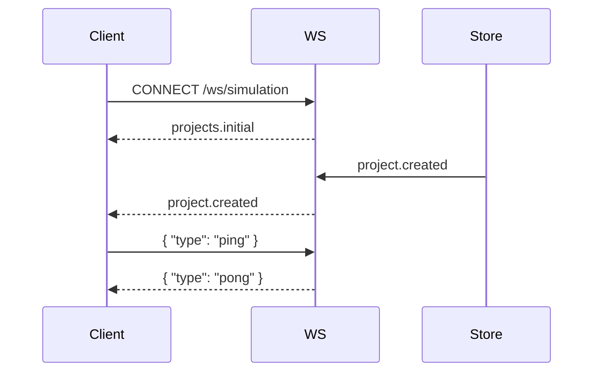
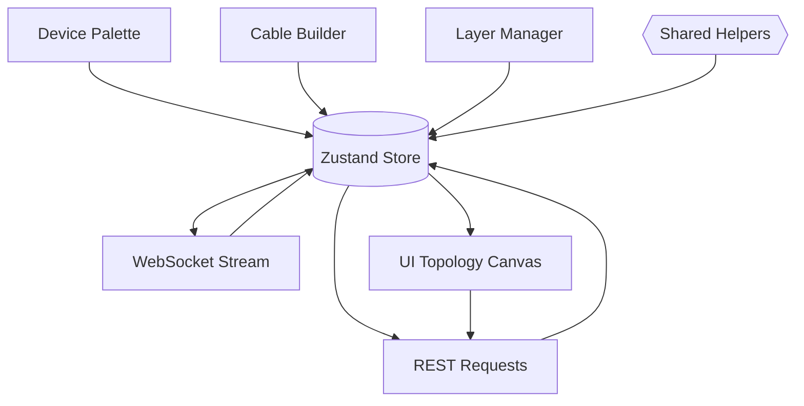

# 🌐 Network Simulation Data Contracts & Flows

> _One domain language, shared across backend, frontend, and docs._
>
> Everything under `src/shared` is the truth source. Import the types, follow the shapes, and your features stay in lockstep.


---

## 1. Canonical entities

Each object is intentionally ergonomic for canvas visualisers, config editors, and stream processors. They live in [`src/shared/types.ts`](../src/shared/types.ts).

| Entity | Core role | Favourite fields |
| --- | --- | --- |
| `Device` | Switch, router, host, firewall, wireless controller, or IoT gateway | `interfaces`, `configuration.capabilities`, `status`, `position` |
| `DeviceTemplate` | Blueprint used by the palette to spawn devices | `interfaceBlueprints`, `defaultConfiguration`, `category`, `icon` |
| `CableProfile` | Describes cabling or wireless media for link drafting | `medium`, `bandwidthMbps`, `latencyMs`, `color`, `connectors` |
| `Link` | Connects two interface endpoints | `bandwidthMbps`, `latencyMs`, `status`, `metadata.profileId` |
| `TopologyLayer` | Layer toggle for physical/logical/security/wireless views | `type`, `visible`, `locked`, `order`, `color` |
| `CanvasAnnotation` | Text, zone, shape, image, or path overlay | `position`, `size`, `color`, `background`, `metadata` |
| `Packet` | Logical payload moving across a link | `payloadType`, `sizeBytes`, `ttl`, `metadata` |
| `SimulationState` | Snapshot of the simulator heartbeat | `status`, `currentTick`, `metrics`, `lastEventId` |
| `SimulationEvent` | Immutable change description | `simulation.*`, `packet.*`, `interface.state-changed`, `topology.updated` |
| `SimulationPlaybackState` | Controls the Packet Tracer-style time slider | `isPlaying`, `speedMultiplier`, `cursorTick`, `bookmarks` |
| `Scenario` | Snapshot used for guided labs and challenges | `objectives`, `difficulty`, `topologySnapshot`, `tags` |
| `Project` | Container for topology, playback, scenarios, and events | `topology`, `simulation`, `playback`, `scenarios`, `eventLog` |

### Event taxonomy



> 💡 **Tip:** `SimulationEvent` is discriminated by `type`, so TypeScript narrows payloads automatically.

### Palette & media blueprints

- **Device templates** bundle vendor defaults, port layouts, and recommended layers—perfect for draggable palettes.
- **Cable profiles** encode medium, bandwidth, latency, colour, and connectors so every rendered link can look and behave like the real thing.

---

## 2. Simulation helpers

The helper toolkit in [`src/shared/simulation.ts`](../src/shared/simulation.ts) gives both backend and frontend deterministic behaviour.

| Helper | What it does | Why it matters |
| --- | --- | --- |
| `createInitialSimulationMetrics()` | Produces zeroed counters | Makes sure metrics objects are never `undefined` |
| `createDefaultTopologyLayers()` | Seeds physical/logical/security/wireless layers | UI can assume consistent layer IDs and colours |
| `normalizeTopology(topology)` | Clones devices, links, layers, annotations, and views | Prevents stale references and injects defaults |
| `ensureSimulationState(state?)` | Pads missing fields with defaults | Simplifies migrations and partial updates |
| `ensurePlaybackState(state?)` | Normalises playback state and bookmarks | Time slider stays predictable across clients |
| `applySimulationEvent(project, event)` | Pure function applying an event | Guarantees identical results across server and client |
| `normalizeProject(project)` | Sanitises the entire project tree | Avoids rendering edge cases and keeps logs trimmed |
| `normalizeProjects(projects)` | Map of normalised projects keyed by id | Perfect fit for Zustand or other stores |

```ts
import { applySimulationEvent, ensurePlaybackState } from '@shared';

const nextProject = applySimulationEvent(currentProject, event);
const playback = ensurePlaybackState(nextProject.playback);
// ✅ Both backend and frontend derive the exact same mutations & timeline cursor
```

---

## 3. Backend surface area

The Express server (`src/backend/server.ts`) is stateless outside an **in-memory project store**. The store itself speaks the shared language, so swapping to a database involves zero schema gymnastics.

### REST endpoints

| Method | Path | Notes |
| --- | --- | --- |
| `GET` | `/api/projects` | Returns `ProjectSummary[]` for lightweight dashboards |
| `POST` | `/api/projects` | Accepts `ProjectCreateRequest`; validates `name` + `topology` |
| `GET` | `/api/projects/:projectId` | Full `Project` payload (topology + simulation state + playback + log) |
| `PUT` | `/api/projects/:projectId` | `ProjectUpdateRequest`; respects partial updates, playback tweaks, and scenario swaps |
| `DELETE` | `/api/projects/:projectId` | Idempotently removes a project |
| `POST` | `/api/projects/:projectId/simulation/events` | Hydrates `id` + `timestamp` if missing, applies event, broadcasts |

Sample create request:

```jsonc
{
  "name": "Campus Core",
  "description": "Lab topology for QoS experiments",
  "topology": {
    "devices": [
      {
        "id": "rtr-1",
        "name": "Core Router",
        "role": "router",
        "status": "online",
        "configuration": { "capabilities": ["routing", "monitoring"] },
        "interfaces": [
          { "id": "ge-0/0/0", "name": "uplink", "macAddress": "AA:BB:CC:DD:EE:FF", "status": "up" }
        ]
      }
    ],
    "links": []
  },
  "scenarios": []
}
```

### WebSocket channel

| Message | Payload | Dispatch trigger |
| --- | --- | --- |
| `projects.initial` | `Project[]` snapshot on connection | Connection handshake |
| `project.created` | `Project` | REST `POST /api/projects` |
| `project.updated` | `Project` | REST `PUT` or simulation events |
| `project.deleted` | `{ projectId }` | REST `DELETE` |
| `simulation.event` | Individual `SimulationEvent` | Any accepted simulation event |
| `pong` | `{ timestamp }` | Reply to client `{ "type": "ping" }` |
| `error` | `{ message }` | Malformed client messages |

Connection flow:



---

## 4. Cisco Packet Tracer-inspired workflow

The Zustand store (`src/frontend/state/networkStore.ts`) mirrors backend logic and layers on a Packet Tracer-style UX. Highlights:

| Capability | API surface |
| --- | --- |
| Device palette | `deviceTemplates`, `addDeviceFromTemplate(templateId, position)` |
| Cable builder | `beginConnection(deviceId, interfaceId)`, `completeConnection(deviceId, interfaceId)`, `cancelConnection()` |
| Media awareness | `cableProfiles`, metadata embedded in generated `Link` objects |
| Layer control | `toggleLayerVisibility(layerId)`, `toggleLayerLock(layerId)`, `upsertLayer(layer)` |
| Annotation studio | `addAnnotation(annotation)`, `updateAnnotation(id, patch)`, `removeAnnotation(id)` |
| Layout intelligence | `alignSelection('horizontal' | 'vertical' | 'grid')`, `autoLayout('grid' | 'circle' | 'tree')` |
| Scenario lab | `createScenarioFromActiveProject(seed)`, `applyScenario(id)`, `updateScenario(id, patch)`, `deleteScenario(id)` |
| Playback timeline | `setPlaybackState(patch)`, `addPlaybackBookmark(label, eventId, tick)`, `removePlaybackBookmark(id)` |

All mutations share the same helper utilities as the backend to maintain deterministic updates across clients.

---

## 5. Putting it together



### Lifecycle narrative
1. REST responses and WebSocket broadcasts pipe through shared helpers.
2. Zustand ingests the same contracts, ensuring visual state matches server truth.
3. Editors tweak `topologyDraft`, drop devices from the palette, and apply cable profiles before pushing updates via REST.
4. Scenario snapshots capture entire topologies for guided labs, and the playback timeline keeps the Packet Tracer vibe alive.

> 🪄 **Next step idea:** Add a background worker that emits packet events in real time—your UI already knows how to digest them.

---

## 6. Reference glossary

| Term | Meaning |
| --- | --- |
| **Topology** | The device + link graph that the simulator understands |
| **Topology layer** | Visual layer (physical/logical/security/wireless) with independent visibility & lock state |
| **Simulation tick** | Incrementing counter indicating progression of the simulator clock |
| **Playback bookmark** | Saved cursor position for quickly jumping to a pivotal event |
| **Scenario** | Saved topology snapshot with objectives for drills or guided practice |
| **Event log** | Chronological list of timeline entries, trimmed to keep clients fast |

Stay curious, keep packets flowing, and make the topology glow ✨
